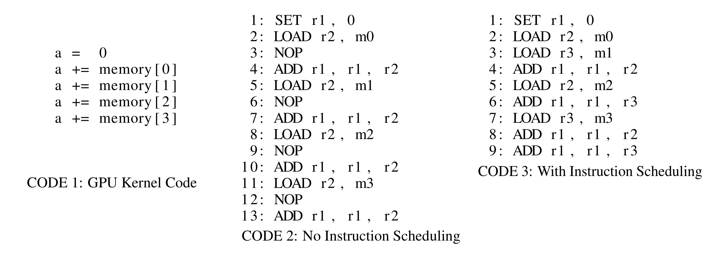

# 单一图像卷积：一个mobile GPU的算法

距离上次编辑这本书已经过去三个月了，即便是像我这样厚脸皮的人，如此拖更都感觉有些愧疚和不安。并且，所写的东西距离这本书的主旨已经相去甚远了，想想自己一直以来，也没有什么东西能坚持下去，不禁焦虑不安。所以，我决定开一个番外的番外，来把题目继续岔开，这样看看能不能把书名改一改（没想到吧）。当然，我们最近也有一个关于驱动的想法，估计搞完之后我**可能**也会更新到这本书上。

我决定在这一段最后为自己辩护一下，因为写这本书的目的就是~~闲的难受想写点段子~~想解决之前深度学习框架在Mali GPUs上运行不够快的问题。但是随着时间的推移，我发现这是一个在很多mobile GPU上都存在的问题（当然除了Adreno），所以我也尝试着从不同的角度去解决这个问题。然而人比人能聪明到哪里去是吧，况且我可能还稍微笨点儿，所以可能就解决的慢一点，角度就散一些。这个映射到这本书上呢，就是拖更和不知所云。但是如果你细想，就会发现其实我是在找借口。。。

好吧，讲点正事儿。虽然深度学习因为大家把容易做的都做的差不多了，因而已经没有那么火了。但是对于一个局外人来看，其实并不一定是个坏事儿，因为其在工业上的部署正变得越来越成熟。越来越多的实验室里设计出来的神经网络正被应用到我们生活中的方方面面，比如无人车，无人机上的那一套识别系统，比如越来越多的有趣的apps。这些玩意儿都会用到卷积神经网络，我虽然没有细究过到底他们用的是CPU还是GPU，也不知道他们用的什么算法，甚至不知道他们是否一次只会处理一张图片，而且只会去做推理\(inference\)。但是我的原则是，即使我没有调查，我还是要发言。所以我假设他们是用大家熟知的im2col，Winograd或者direct conv这些方法，而且每次只处理一张图片。至于是用CPU，GPU还是其他的呢，那就不是我关心的问题的了，因为我是做GPU的。。。但是我觉得吧，神经网络有很大的并行性，这时候不用SIMD的东西而是使用CPU就很亏。而对于那些奇奇怪怪的NPU或者TPU吧，他们本质上就是SIMD处理器，无非是在cache上为神经网络做了点过度优化，所以基本上GPU上用的优化方法在这些东西身上也能用。

其实这一章节虽然看上去在连载，但是稿子已经完成了。我把它放到arxiv \([https://arxiv.org/pdf/1909.02765.pdf](https://arxiv.org/pdf/1909.02765.pdf)\)上了，但是当时写的较为仓促以及我的洋文不是很好，所以我还是建议不要去看剧透，听听我在这里扯淡就算是对我最大的鼓励了。

### 在mobile GPU上的单一图片卷积神经网络推理是一个新问题

我为什么要强调“单一图片”，“mobile GPU”和“推理”呢？因为这和~~我们~~他们平常做的卷积神经网络有些许不同。因为现在的卷积算法都是为在相当好的GPU上的mini-batch的神经网络训练设计的，这个在一般的mobile GPU上的单一图片的神经网络推理就有挺大的不同的。

#### 单一图片不咋会享受thread-level parallelism

首先，最重要的一点，单一图片推理每次只会计算一张图片。看起来好像做的工作少了很多了，是不是也会容易一些呢？其实不然，因为GPU本来就是为了massively的并行任务而设计的，所以GPU是高延时高throughput的设计取舍。然而平常我们并不是很为GPU的高时延而苦恼，这主要归功于GPU使用了两种方法来把这个时延藏起来不让你看到：thread-level parallelism \(TLP\) 和 instruction-level parallelism \(ILP\)。 

TLP其实是GPU来hide时延的主要方法，一般在一个GPU的计算单元上，都会放很多个warp\(虽然我写OpenCL多一点，但我还是喜欢NVIDIA的命名\)。当这个计算单元闲下来的时候，他就会去挨个瞅瞅他的warps，看有没有warps有可执行的指令，如果有的话了，那么这个指令就会被fetched并且issue出去。这样一来，一个warp如果需要从global memory读取数据的时候，其所在的计算单元不会傻等着这个内存进来，而是继续执行其他warps的指令，所以整个GPU其实一直都在干活，而且是干有用的活。如此一来只要带宽够，throughput就非常的高。等等，好像哪里不太对劲儿，如果我们只有一张图片，那我们去哪里开那么多warp呢？要不然设计一个apps，让用户必须攒64张图片，攒齐了我们再把他们一块儿放到mobile GPU里，这样不就能利用TLP了吗？好吧好吧，如果我能一本正经的根据这个写篇东西也是有点厉害。

既然不能利用TLP，那么就要想办法利用ILP。ILP其实不是GPU的专属，几乎所有的处理器都有用到这个技术。ILP会独立的issue没有依赖的指令，这样多个指令就都在流水线里进行，一部分时延就被隐藏起来了。另外，编译器还会倾向于将计算指令和内存读取指令糅合起来来最大化流水线程度。这里我们用一个例子\(CODE 1\)来解释一下ILP，在这个例子里我们让每个线程去求一个数组的和。并且我们假设有这样一个GPU，他的浮点数加法消耗一个cycle，内存读取消耗两个时间周期，并且是同步的指令，所以在数据还没有送到的时候，需要手动插入NOP指令来等待。当然我们都知道，一般来讲GPU的内存读取会消耗几百个内存周期，并且是一个异步指令。

最愚蠢的翻译方式就是 CODE 2 的实现方式，当然如果非要争论说我们先等待个十年八载的再去执行会消耗更多的时间，那么严谨的来说我赞同这个说法。在CODE 2里，我们会在tick2发出读取m0到r2的指令，但是m0在tick3并没有就绪，所以接下来的加法计算并不能被执行，这时编译器就会在tick3插入一个NOP指令，来保证加法指令能得到正确的数值。这个汇编码需要整整13个时钟周期。

然而如果我们舍得花钱买一些机智的带有指令调度的编译器，那么我们可能会得到CODE 3。当编译器发现在tick3不能执行加法计算的时候，他会往下看一看，然后惊奇的发现加载m1并不需要m0的值，这两条指令是相互独立的。所以编译器就把加载m1的指令放到加法计算前面，这样GPU实际上一直在工作而避免了傻等。有了ILP，总的执行时间被减少到了9个cycle，并且GPU的利用率也达到了100%。但是需要注意的是，m1需要被加载到另一个寄存器里\(r3\)，因为r2的值在之后还会被用到，所以我们不能复用这个寄存器。

世界上没有免费的午餐，指令调度也不是凭空而来，我目前觉得主要有两个限制。第一个限制就是memory barrier。因为基本上GPU的优化就是想办法让一个workgroup里的每个thread去从global memory里读取一个数据到shared memory里，然后这个workgroup里的所有threads共同利用shared memory的数据。因为一个thread要利用别的threads拷贝到shared memory的数据，所以在读取shared memory的时候，我们需要加一个barrier来确保所有的threads都把值存到了shared memory里。为了保证程序的正确性，编译器不能跨过barrier来调度内存操作，所以内存调度的自由性就被大大的限制住了。即使我们手动去调度高级代码（比如OpenCL），也几乎不可能实现跨barrier的内存流水线化，因为OpenCL的barrier是针对全部shared memory的。在OpenCL里，barrier不能指定要barrier哪一部分shared memory。比如我们有两块儿share memory，记做S1和S2，也有两组计算块儿，记做A1和A2。其中A1需要且仅需要S1的值，A2需要且仅需要S2的值。但是由于barrier是全局的，所以如果A2在排在后面，那么A2在OpenCL的表达里是依赖于S1和S2的。当然现在很多GPU是确保shared memory操作的顺序的，所以直接写汇编码是可以巧妙的解决这个问题的。但是由于GPU的kernel代码经常需要tuning，而直接写的汇编码实在是有点难改动啊。至少我感觉直接写汇编码的成本高到难以忍受，家里有矿也负担不起。

另一个限制来源于寄存器的使用。从global memory里读取到的数据需要找个寄存器存，如果我们想要同时读取2个数据，就得要两个寄存器，这样比较多的流水线化会极大的增加每个thread的寄存器使用量。在我的印象里，GPU不支持动态改变每个threads的寄存器使用量。也就是说，在launch GPU的kernel的时候，我们就需要给每个thread分配他需要的最大内存量，并且这些寄存器需要在这个thread的整个生命周期都被reserved。因为每个计算单元的寄存器数目是一定的，更多的寄存器使用量就意味着更少的warp可以被摆在这个计算单元上，也就意味着更少TLP。但是我们前面分析过，本来TLP就不咋够，所以这个本来棘手的问题反倒不是问题了。

#### Mobile GPU的内存带宽以及能源消耗

另一个挑战来自于mobile GPUs的内存带宽其实不咋地。Mobile GPU和集成显卡都是使用单通道或者双通道的DDR4或者是LPDDR4来当作global memory。他们的内存带宽相较于独立显卡上的GDDR6和HBM2实在是不够看。双通道的LPDDR4的内存带宽大约在 30GB/s左右，而GDDR6一般是600GB/s左右，带宽更高的HBM2可以达到1TB/s的内存带宽。雪上加霜的是，mobile GPUs一般是在SoC上的，如此拮据的内存带宽还需要跟CPU和其他的处理器\(例如DSP\)来共享。如此一来，mobile GPUs真正的内存带宽其实更窄了，明明在集成显卡上跑的好好的代码，我一放到mobile GPU上，内存立马成了瓶颈。这就是我跟明明的差距。。。

另外，这种off-chip的内存访问通常需要消耗相较于浮点数计算数十倍的能量。虽然现在有人开始考虑神经网络的能耗，但是谁还烧不起点电钱啊，所以在开发卷积神经网络的算法的时候，基本没有人考虑能耗这一方面。但是mobile GPUs等通常会被用在电池驱动的设备上，这样一来能耗就跟续航时间挂钩了。谁也不愿意一运行个神经网络就掉一大块儿电。

所以在内存读取和浮点数计算之间进行取舍的时候，在mobile GPUs上一般来讲需要更多的偏向浮点数计算。

#### 对于推理而言，tuning是可行的

最后，从工程的角度来看，训练和推理也有所区别。对于训练而讲，我们通常会尝试多种多样的神经网络结构，多种多样的卷积参数。比如，我们有时候改变channels数，改变卷积核的大小，甚至连batch size都有调整着去试图提高准确率。在这种情况下，我们偏爱于一种运行速度较为稳定的卷积算法。这种卷积算法可能在某一个结构或者参数下不是最优的，但无论对于哪一种结构或者参数，他都能提供较为不错的运行速度。这样就能把~~神奇宝贝~~神经网络训练师从tuning GPU kenrel上解放出来，而专注于设计神经网络。然而在推理的时候，整个网络结构和参数都是确定的了，这个时候神经网络训练师的工作已经做完了。所以目标就变成了试图找到一个算法，tune之以期达到最短的运行时间和最少的能量消耗。特别是神经网络经常部署在较为低端的设备上，花点时间和功夫去tuning GPU kernels是值得的。

这一小节就写到这里吧，其实在码字的时候我一直在听野狼的士高，所以我要去买灯球了。。。

