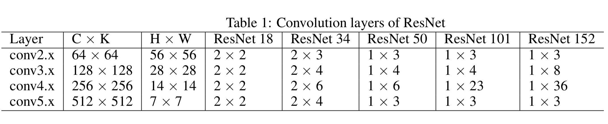

# 说了半天，结果怎样？

说来你可能不信，我这次是先写完正文再写闲白的，最可怕的是我居然没有什么可写的了。更可怕的是，我盯着屏幕10min还是没想好要写啥。最最可怕的是，我好不容易写了个关于茶叶的闲白之后，gitbook出了bug，我写的闲白就这么消失了。所以这一期没有闲白了。我说的都是真的，是真的，真的。

我们用我所知道的最好使的最流行的ResNet卷积神经网络和ImageNet数据集来测试我们的算法。ResNet千千万万，内部形式不会变。无论是ResNet-18还是ResNet-152，他们的非1x1卷积就只有五种，其中有一个7x7的卷积还有4种3x3的卷积。在ResNet中，虽然3x3的卷积多，但是如前面所说，只有4种。这4种3x3的卷积的参数以及在每种ResNet中所出现的次数在下面的表格里被列出来了。在我们的实验里，那个7x7的卷积被忽略掉了。因为无论多少层的ResNet，那个7x7的卷积就只有一层，其所占比重无足轻重。再就是Winograd在7x7的卷积上表现不会很好，实现也比较复杂。好吧，我说实话，我觉得单独为了一个只有一层的卷积层来特地写那么多东西好烦啊，所以就不去测了。。。

至于实验平台，我们总共选了三个比较有代表性的，分别是SoC上的mobile GPU，集成显卡和独立显卡。具体的细节和配置在下面的表格里都写了，别问为什么没用V100，问就是太贵。

我们搞了个老大老大的图来展示不同的卷积层在不同的GPUs上的执行时间。说实话很令我震惊的是HNMTP在每一种卷积层上和每一个平台上都表现的比其他的所有算法都好。这在我的科研生涯中是极其少见的，因为一般来说我会花两天的时间实现一个自认为牛逼的不行的算法，然后测试了之后比人家最慢的还要慢25%。一顿操作猛如虎，最后结果慢二五。我分析主要是因为单张卷积情况下的TLP实在是太不够了，所以依赖TLP的算法都比较难受。而HNMTP给编译器进行指令调度的空间比较大，所以ILP比较高，这样一下就有了优势了。由于图太XX的长了，所以我不得不在这里提醒一下，图后面还有文字。。。

由于libdnn消除输入矩阵从global memory读写的开销，所以在mobile GPUs上和集成显卡上，其执行时间都比im2col的方法快一些。这是因为mobile GPUs上和集成显卡的带宽都有些捉急。但是在拥有HBM2内存的独立显卡上，libdnn就比im2col慢了不止两倍。这和我的认知是相符的，因为很多深度学习框架都是用im2col来作为卷积的算法。

可能会有点奇怪的是，为啥Winograd卷积算法在Radeno VII和Vega 8上表现的这么挫。这里其实赖我，因为我是直接用clBLAS库来做的的矩阵乘法，所以Winograd的16次矩阵乘法被串行化了。如果能自己写一个矩阵乘法的函数，把这16次矩阵乘法搞到一个kernel里，那么其执行时间是可以被大大加快的。我之所以没有这么做，其中一个原因就是众所周知的：因为我懒。还有另一个原因就是我们可以安全的根据Winograd在Mali G76上的比表现推测出Winograd大约在Radeno VII和Vega 8上表现如何。大致上如果我们把16个矩阵乘法和起来算的话了，可能就跟在Mali G76上单个算差不多。其实Winograd的理论加速比就是2.6倍，无论如何也超不过这个加速比了。算下来这个速度在Mali G76上还没有直接卷积快，就更不要说HNMTP算法了。

在绝大部分实验中，直接卷积算法比libdnn卷积算法稍微好一点点。需要说明的一点是，在我们的实验中，直接卷积都是采用了不缓存卷积核的做法。其实两个算法我都试验过了，不缓存一般比缓存要好不少，但是懒得写了。在L2缓存的帮助下，直接卷积和libdnn有差不多的全局内存读取数量，但是直接卷积有着更高的ILP，以及需要计算的下标和内存地址更少。但是直接卷积需要付出更大的努力去tune代码，虽然我写了个代码自动去tune，但还是比较烦。但是我们能做的更好吗？

当然！不然我为什么要写这篇文章。HNMTP在执行时间和tuning代价上都远好于直接卷积算法。特别是在mobile GPU上和集成显卡上，相较于直接卷积，HNMTP卷积分别最高减少了大约50%和46.6%的执行时间。最计算里最低的mobile GPU上，HNMTP卷积分别实现了对于im2col 14.6倍的加速，对于libdnn 3.1倍的加速，对于Winograd卷积10.7倍的加速以及对于直接卷积算法2.1倍的加速。同时HNMTP卷积算法由于有更少的global memory读写，所以降低了内存带宽的消耗和能源开销。同时，tuning HNMTP卷积算法也比tuning直接卷积算法容易多，因为我们的算法有更少的超参。

### 未来工作

这不能说啊。。。

