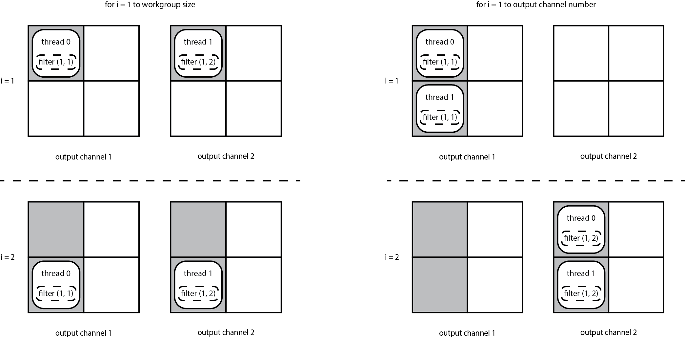
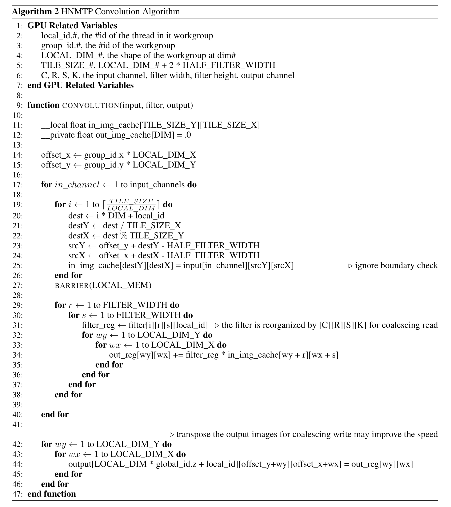

# 我们干了个啥：映射thread到输出图像的channel上

今天是中秋节，而我仍漂泊在外。由于空间上的间隔以及假期实在太短，想来我已经六年没有在家里过过中秋节了。但是对于我的家乡来说，中秋节回家团圆固然好，但是即使没有，也远没有在外过年那种寂寞。况且身处十分接近热带的亚热带地区，九月份也远谈不上秋风萧瑟和冬日凛冽，既然不触景，何必自伤情，所以我决定继续更新这一章节。

小的时候对节日的理解就是吃，中秋节的月饼，元宵节的元宵，重阳节的大闸蟹（因为我不喜欢吃粽子，所以我决定故意不去写端午节的粽子，而且重阳节也不吃大闸蟹，只是因为我基本在那个时间会去吃大闸蟹）。不似现在，小的时候对于吃甜食还是很期待的，那么一年一度的能大量吃月饼这种高油高糖的食物的节日还是很令人期待的。而对于月饼，我是属于比较小众的伍仁派的。因为在我看来只有伍仁月饼才配的上“_春江潮水连海平,海上明月共潮生_。滟滟_随波千万里,何处春江无月明_”的豪迈。这里必须要argue一下，在我小的时候，月饼仅限于伍仁，豆沙和乱七八糟的果酱馅儿，无论怎么挑都是伍仁胜出。哪像现在，有XX的奶黄月饼，XX的冰皮月饼以及各种各样的鸭蛋黄白莲蓉月饼，喜欢伍仁月饼才显得另类。

再就是现在的伍仁月饼也都偷工减料，真正地道的伍仁月饼不仅要有核桃仁、杏仁、橄榄仁、瓜子仁和芝麻仁，还有配有葡萄干，柑橘皮和萝卜皮制成的红丝和青丝等。真正上好的伍仁月饼吃起来松软不腻，刚入口的时候会有一些甜但是之后只有越嚼越香。虽然这么说，但是作为一个资深的伍仁月饼铁杆粉儿近几年也是更多的吃冰皮和奶黄了。一是之前说的由于现在人们吃伍仁月饼少了，也就没有厂家愿意去精进伍仁月饼的工艺和技术。另一方面就是材料本身的限制，坚果的口味无论如何也比不过变化多样的冰皮月饼，而费劲心思调制的口感先天上也较奶黄月饼不足，伍仁月饼或许越来越只能成为以前的记忆。

好吧，让我们抽时间讲点正事儿。前面铺垫了那么多，又是讲单张图像卷积神经网络的推理和mini-batch的神经网络训练的不同，又是逐个分析了现有的GPU卷积算法的不足，如果就此戛然而止，给大家留下无穷无尽的遐想，应该是最符合我的审美的。但是现实可能跟我理想的美有所不同，所以我决定还是把我们提出的算法写出来。其实说实话也没有什么太大的改动，还是基于直接卷积的一种卷积算法，只不过通过一些巧妙任务划分来避免了要不要协同读取卷积核这个进退维谷的局面。我给我的卷积算法取了一个俗不可耐的名字，叫做HNMTP\(**H**NMPT does **N**ot **M**ap **T**hreads to **P**ixels\) Conv。顾名而思义，HNMTP Conv的核心思想就是在计算卷积的时候，并不把一个workgroup的每个thread映射到同一个输出channel的一块儿pixels上。反而，一个workgroup的每个thread被影射到不同的输出channel上去，并且每个threads会遍历其所被分配的这个workgroup所属的所有pixels。由于不同的thread被影射到不同的output channel上去，因而他们读取的是不同的卷积核，所以并不需要barrier去确保大家都完成了读取。另外，由于在一个workgroup里每个卷积核只被一个thread读取了一次，所以不像non-cache直接卷积一样需要大量的寄存器去储存不同的数据。所以对于计算同样的大小的一块儿输出图像，我们的方法跟协同读取卷积核的方法有相同的global memory读取数量和寄存器使用量却又跟不协同读取卷积核的方法一样不需要barrier，可谓是集二家之长而又无二者之短。鉴于我的表达可能不太清楚，所以不如看下面的图，虽然我没有说，但是看上去左边的比较机智一些，因为~~那是我提出来的~~同一个thread用的是相同的filter。

和直接卷积一样，HNMTP卷积算法也是让所有的threads去共同读取输入图像并且存储到shared memory里。在这个阶段，每个thread被映射到一个像素点上。而在这之后，每一个thread会被映射到不同的输出channel上，并计算在其对应的输出channel上整个workgroup所对应的所有pixel。因为计算一个输出channel上所有pixel利用的是同一个卷积核，所以每个thread在其生命周期只会读取一个卷积核。相较于直接卷积，如果计算相同的输出channel（也就是workgroup\_size个），每个thread需要读取workgroup\_size个卷积核。如此一来，高下立判。

为了进一步减少寄存器的使用，在HNMTP卷积算法里，每个thread会先读取一个卷积核的一个参数，用这个参数去和所有的输入pixels相乘并累加到输出pixels里。然后再去读取这个卷积核的下一个参数，重复上面的操作。这样的话了理论上最少只需要给卷积核分配一个寄存器就够了，而如果我们能分配两个寄存器，那么就可以流水线化两倍的计算量。同理三个寄存器就是三倍的流水线化，所以HNMTP卷积算法的理论流水线化程度是非常高的。具体的算法如下图所示。

HNMTP卷积算法继承了直接卷积的所有优点，而直接卷积被我认为是所有算法中最适合进行在mobile GPU上进行单张图片卷积神经网络的推理。同时，我们的卷积算法解决了直接卷积对于是否协同读取卷积核左右两难的局面。HNMTP卷积算法使用了和缓存卷积核算法相同的global memory读取数量和寄存器数目，却没有引入令人懊恼的barrier。在两个barrier之间（读取输入图像的barrier），我们一共有kernel\_size个global memory读取和kernel\_size \* workgroup\_size个浮点数计算。所以编译器有相当大的空间去进行指令调度来隐藏时延。即使只有寥寥几个warp，ILP也能保证GPU一直在干过，因而实现了很高的GPU利用率。

另一方面，不同于不缓存卷积核的方法，HNMTP卷积没有引入重复的global memory读取也没有浪费宝贵的寄存器去储存相同的数据。如果要流水线化N个计算组，我们的方法只需要N个寄存器才存储卷积核，而不缓存卷积核的直接卷积需要则需要_`卷积核大小`_个寄存器。换句话说，对于相同的寄存器数目，我们能流水线化_`卷积核大小`_倍的计算组。另外，即使有L2缓存来减轻global memory的带宽，直接卷积算法里重复的global memory读取也引入了issue指令的额外开销以及L2缓存的带宽压力，这在我们的HNMTP算法里则都被避免了。

把有用的东西都唠叨完了，之后就是更新一点实验结果了。对了，如果想看代码的话了，[https://github.com/jizhuoran/sj\_convolution](https://github.com/jizhuoran/sj_convolution)。我还没有重构代码，可能代码会比较气人，但是还是希望能给个小星星。

