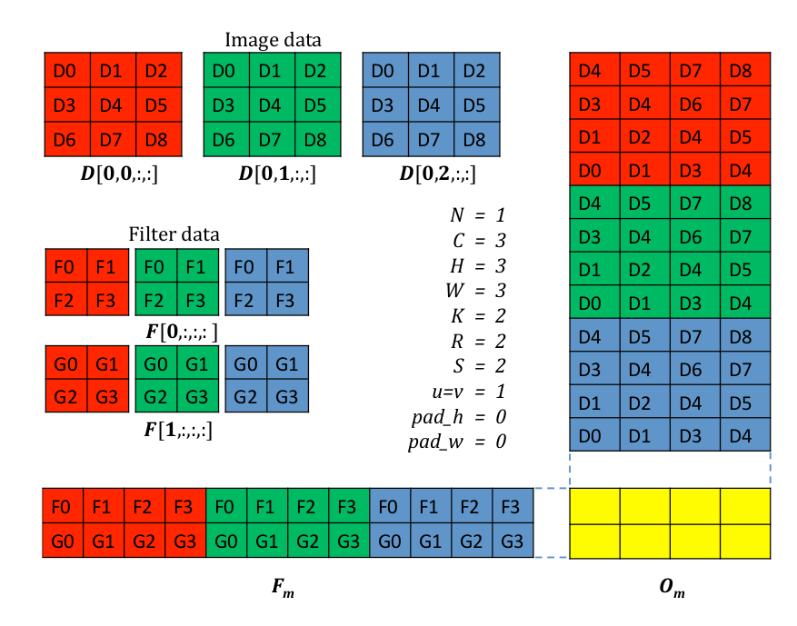
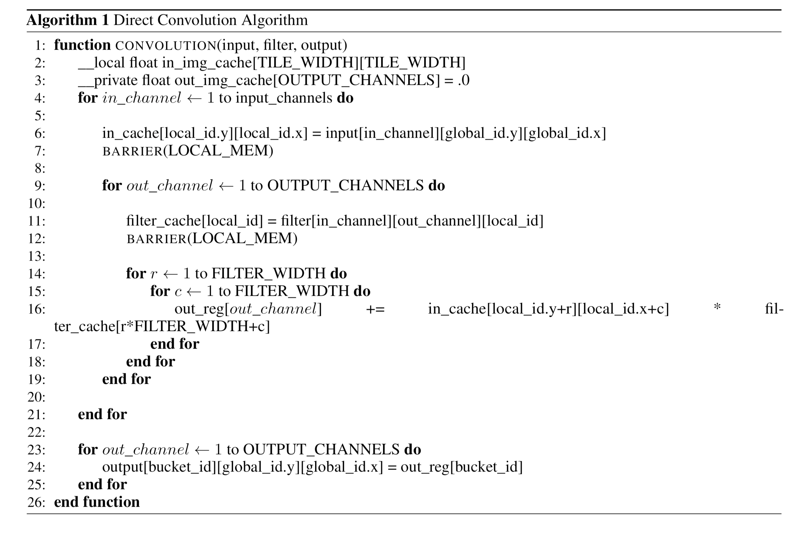

# 现有的方法哪里不带劲了，用得着你弄个新的？

距离更新上一章已经过去一天了，在这一天里并没有发生什么有趣的事情。本来觉得没有好一点的闲白应该鸽了这一期的，但是想想昨天刚立下不拖更的flag，所以还是决定强行写点东西。

算了。。。鸽了。。。

由于深度学习的蓬勃发展，催生出了很多GPU的卷积算法。已经有了这么多卷积算法了，我们为什么还要再提出一个卷积算法呢？如果你也有相同的疑问，请看上一节。那么那些为mini-batch卷积神经网络训练设计的GPU卷积算法为什么不能直接在单一图片的推理上实现最短的运行时间呢？在这一节，我们将粗略的分析分析现有算法的不足。当然，因为个人行文风格的原因，为了突出矛盾深化主题可能在评价算法的时候发表不恰当的言论和使用不合适的修辞手法。但是俗话说的好“台上无大小，台下立规矩”，在这里我先提前道一个歉。这些算法都是伟大的算法，并且在神经网络训练的任务中都能实现相当好的性能。对于他们所要解决的问题，这些都已经是最优的算法了，但是对于单一图片的推理，难免有些水土不服。

#### unrolling-based卷积算法

unrolling-based卷积算法应该是在卷积神经网络中使用最广的算法。这个算法的主体思想是把难以优化的多channel卷积问题转变为已经被做的相当好的矩阵乘法问题。输入图片上的每个要被卷积核扫过的区域都被展开成一列放到一个矩阵里\(记为输入矩阵\)，而对应的卷积核则被展开成一行放到另一个矩阵里\(记为参数矩阵\)。这样输出矩阵的每个数据都是输入矩阵的一列和参数矩阵的一行的点积，也就是说输出矩阵就是输入矩阵和参数矩阵的乘积（下面这张图是我盗来的，我觉得人家画的挺清楚，我是没耐心画）。这样一来卷积问题就被转化成了矩阵乘法的问题，而矩阵乘法的实现有千千万，像cuBLAS和clBLAS都是相当快的实现。我把这种方法叫做im2col卷积，因为这个展开的过程被叫做im2col。

这里有一个小地方需要注意，因为BLAS库基本上都是把矩阵乘法封装成一个叫做GEMM的单独的函数。所以im2col卷积都会先进行im2col，把图片从global memory读进去，展开成输入矩阵，然后再把输入矩阵写回到global memory里来给后面的GEMM函数使用。由于输入矩阵是输入图片的展开，所以他一般会比较大，有多么大呢，大约有下图那么大。

好吧，输入矩阵的大小是输入图片的**kernel\_size**倍。把这个大的一个矩阵写回到global memory里再读取回来引入了不小的overhead。所以有另一种unrollling-based卷积算法，叫做libdnn。我最早在Caffe的OpenCL分支里看到libdnn的实现，他把im2col和GEMM整合到一个GPU kernel里。libdnn并不会去读取输入矩阵，而是假装有这么个输入矩阵，当需要读取其中的某一块儿的时候，就把构建这一块儿所对应的输入图片上的数据读取进来，然后在kernel内部just-in-time的构建输入矩阵的那一块儿来使用。这一块儿在构建他的kernel里就完成了自己的使命，所以可以在kernel结束的时候直接被丢弃而不写回到global memory里。如此一来就节省了输入矩阵的一读一写。

但是需要注意的是，即使libdnn节约了输入矩阵的一读一写，也就是避免了去存储他的空间和读入写会造成了内存带宽的占用，他的性能也不见得就比im2col的方法好很多。第一个问题就是，大家训练神经网络的时候都是拿比较好的GPU，这些GPU有将近1TB/s的内存带宽。再加上thread-level parallelism，这种读入和写回一旦流水线化起来，几乎是不咋需要时间的。另外，由于输入矩阵的每一块儿可能被矩阵乘法的多个threads使用，所以每个这样的块儿的展开可能需要被不同的kernel执行多次。别看这个展开就是点儿下标计算，下标计算可能对于CPU来说不叫个事儿，但是对于GPU来说，需要很多scalar operation，而scalar operation其实还是挺昂贵的操作。最后呢，还有一个不是客观问题的问题，就是把两个kernel结合起来之后给编译器造成了负担，im2col是个内存瓶颈的，GEMM是个计算瓶颈的，让一个计算瓶颈的代码紧跟在一个内存瓶颈的代码后边，经常会把编译器搞的左右为难。编译器可能会做出令人匪夷所思的优化决定，使得整体的性能降低。

#### Winograd卷积算法

Winograd卷积算法在1980左右的时候就被提出来了，但是直到2015年其才被大规模的应用到卷积神经网络里。首先他把输入图像变换成一组小的矩阵，同样的卷积核也被变换成同样数目的小的矩阵的。然后再把这两组矩阵对应位置的矩阵相乘，得到了另一组矩阵，这个矩阵最后再被变换回输出图像。这三个变换都是有简单的加减和常数scale组成的线性变换，所以没有较大的计算复杂度。而且由于变换后的矩阵比原矩阵一般要小得多，所以即使要进行多次矩阵乘法，总的计算量还是大大减少的。对于一个卷积核是 R x R，tile大小是 M x M的卷积而言，对于每一个tile，直接卷积和unrolled-based卷积算法都需要M x M x R x R次乘法操作，然而Winograd卷积算法之需要\(M+R-1\)^2 x R x R次乘法操作。

但是，Winograd卷积算法需要进行变换，而变换的所需要的加法和常数scale操作是随着tile大小以二次方的增长率增长的。所以对于比较大的卷积核而言，变换引入的内存操作和简单加法操作引入的而外开销很快就会超过从矩阵乘法中节省下来的开销。Winograd一般在3 x 3的卷积核上能实现较大的加速，在5 x 5的卷积核上加速就没有那么明显了，可能在7 x 7的卷积核上就要慢于一般的卷积了。另外，Winograd卷积引入了较多的global读写，这在内存带宽较为紧张的设备上可能会成为性能瓶颈并带来大量的能源消耗。

#### 直接卷积算法

直接卷积算法是直接按照卷积的定义进行计算，所以也应该是最古朴的卷积算法。卷积核一个个在输入图像上滑动，计算出点积，然后累加到相应的输出图像里。从所需要的shared memory来看，直接卷积算法应该是需要shared memory最少的算法，因为直接卷积cache直接就是图片而不是展开后的数据。同时，因为直接卷积不需要进行复杂的下标计算和地址计算，直接卷积所需要的scalar操作数远远小于其他的算法。

然而，直接卷积算法需要耗费很大的成本去tune GPU kernels才能获得可以接受的执行速度。对于libdnn而言，重要的超参差不多就只有每个workgroup需要处理的tiles数以及每个tile的形状和大小。直接卷积算法在这些超参之外，还有浩如烟海的其他超参。比如，一个workgroup被分配的输出channels会影响到输入图像会被读取多少次。更为重要的是，卷积核是否要让一个workgroup里的threads去协同读取并cache在shared memor更是一个艰难的选择。如果协同读取的话了，则需要在读取卷积核之后放置一个barrier，而这个barrier不仅会带来同步的开销，也会大大限制编译器的指令调度能力。因为在两个读取卷积核之后的barrier只有寥寥几个计算还没有内存读取，这样编译器无论怎么调度指令，也不能找到一点隐藏时延的方法。由于我们之前分析的，单张图像推理基本不要指望TLP而要从ILP上找流水线化的可能性，这个barrier基本锁死了ILP的可能性。

另一方面，如果我们不去协同读取卷积核，那么倒是有很多卷积核的读取和计算可以被流水线化。但是读取多不一定代表好，因为其绝大部分读取是多余的。而且每一个计算操作都伴随着一个内存读取操作，这降低了计算内存操作的比例。因为每个threads都处理输出图像的同一个channel，所以其实他们需要的卷积核是同一个，如果让每个threads自顾自的读取卷积核，那么相当于每个threads都需要读取_卷积核大小_个数据。这种冗余读取造成的最大的问题就是寄存器的浪费，因为每个thread都需要读取卷积核的全部参数，因而每个thread都需要_卷积核大小_个寄存器去存储这些数据。不然的话了这些读取就不能被流水线化。由于编译器并不能优化这部分的寄存器冗余，所以即使能进行流水线化，寄存器的数量也大大限制了流水化的程度。另外，即使有L2缓存来避免每个threads都真的去global memory里读取数据，由于编译器并不知道缓存时候会命中，所以在进行指令调度的时候对内存读取的成本会有错误的估计而造成优化不当。并且issuing 内存读取指令的成本也是不小的额外开销。

下面的算法是协同读取卷积核的直接卷积算法的伪代码。由于是伪代码，所以我们忽略了边界检查，简化了图像协同读取，并假设输出图像和workgroup一样大。

一般的来讲，对于拥有很高的TLP的神经网络训练，协同读取卷积核是有优势的。然而对于主要依赖于ILP的单一图像的推理，不去缓存卷积核可能会更好一点。

