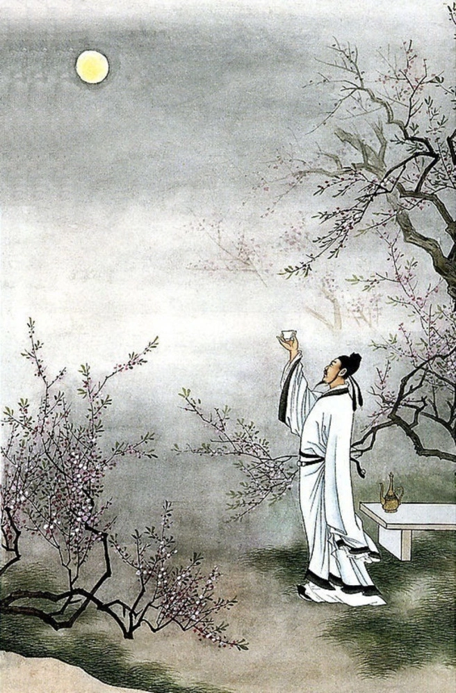
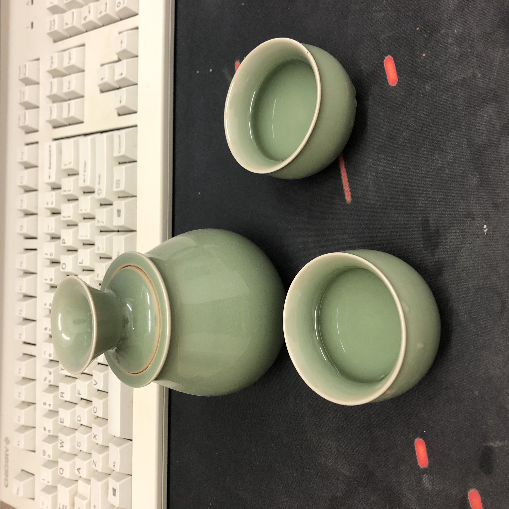

# 周六不喝酒，人生路白走

周五没鸡煲，朋友算白交。周六不喝酒，人生路白走。这算是我从十几岁就遵从的人生哲学。在那个叛逆的年纪，唯有喝酒是我最符合的中国传统文化。能约三五好友一起畅饮尿啤，回忆往事固然开心；竹影灯下自斟自酌也不失为一种乐趣。唐代诗人李白曾言：举杯邀明月，对影成三人。但我搜了很多关于这首诗的绘画作品，大约都是下图这个样子。画这幅画的画家真的令人窒息啊，都举杯邀明月了，不给月亮准备杯子呗。

而作为一个实在的青岛人，若举杯邀月，必备两个杯啊。这张照片是我刚才自己拍的，如果你要吐槽我的照相技术。。。我都用照相而不是摄影了，这要这是张照片而不是一个鼠标那就已经很成功了。哦，对了，今天的文章不会有干货了，今天是闲白专场。两个杯除了能增添情趣之外，还有一个附加的好处，就是可以喝的更快，当然这其中设计了pipeline的原理。

回想大学四年，因为好喝酒认识了不少朋友，也闹出了不少笑话。我们曾在我一个朋友的[出pool饭](https://medium.com/accent-magazine/%E5%87%BApool%E9%A5%AD-6d19c1c927cc)上喝到酒吧给送shot，醉到没人知道shot是棕色还是无色透明，当然最重要的是，那个出pool的伙计不喝酒。。。我还有个朋友，咱也别说是谁，善于喝碎香槟杯和红酒杯。

幸也。

